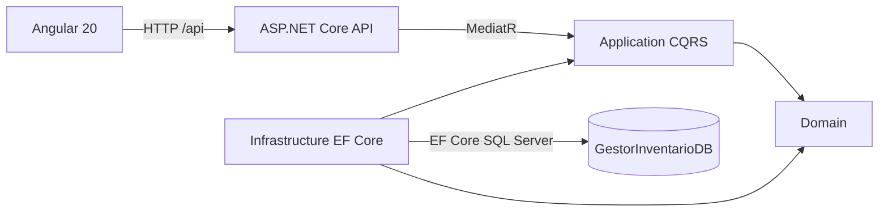
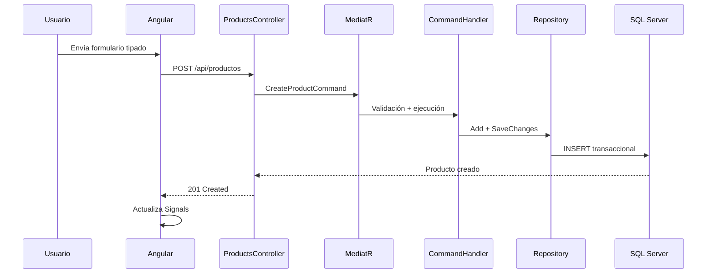

# 01. Arquitectura de la solución

## Vista general



Domain no referencia ninguna otra capa. Application solo conoce Domain y declara los puertos. Infrastructure implementa esos puertos. API compone las dependencias y traduce HTTP a Commands/Queries.

## Flujo de escritura



La validación transversal ocurre en `ValidationBehavior`. El Handler conserva las reglas del caso de uso y la entidad protege invariantes que deben cumplirse desde cualquier entrada.

## Backend

### Domain

Contiene `Product`, `Category`, `InventoryMovement`, `StockMovementType` y `DomainException`. Las entidades exponen comportamiento (`UpdateDetails`, `AdjustStock`) en lugar de permitir que controladores o repositorios alteren reglas de negocio arbitrariamente.

### Application

Organizada por caso de uso. Cada vertical slice contiene Command/Query, Validator y Handler. Los repositorios son interfaces; por ello los tests de Application se ejecutan sin EF Core ni una base real.

### Infrastructure

Configura EF Core con SQL Server, mapeos explícitos, seeds, índices, restricciones y repositorios. Es el único lugar que conoce el motor. `PersistenceContext` también implementa `IUnitOfWork` para que cada Handler confirme una unidad atómica.

### API

Los controladores reciben contratos HTTP y envían mensajes a MediatR. La API configura serialización, CORS, Swagger, health checks y manejo global de excepciones. No contiene lógica de negocio ni acceso directo al DbContext.

## Frontend

```text
src/app/
├── core/       configuración, autenticación, interceptores y servicios globales
├── shared/     componentes reutilizables sin conocimiento de la feature
└── features/
    ├── authentication/
    ├── categories/
    ├── inventory-movements/
    └── products/
        ├── components/
        ├── models/
        ├── pages/
        ├── services/
        └── routes.ts
```

La estructura conserva el principio usado en proyectos React: un componente es una unidad autocontenida con lógica, template, estilo y prueba, mientras que el estado y el acceso HTTP viven fuera de la presentación.

## Estado y renderizado

Cada feature posee un store provisto en su ruta lazy. Sus `signal` privados son la fuente de verdad y sus `computed` exponen estado derivado. Los componentes reciben valores mediante inputs, emiten intenciones mediante outputs y usan OnPush. El proyecto se inicia con `provideZonelessChangeDetection()` y no carga `zone.js`.

## Seguridad

El login entrega un JWT HMAC-SHA256 con issuer, audience, expiración, nombre y rol. Las consultas permanecen públicas para facilitar revisión; las escrituras requieren la política `InventoryWrite`, asociada a `InventoryManager`. Angular conserva la sesión en `sessionStorage`, expira automáticamente el estado y adjunta el bearer token solo a URLs `/api`. La identidad configurable es adecuada para la prueba; producción debe federar un proveedor OIDC y rotar los secretos.

## Integración HTTP

El navegador usa rutas relativas `/api`. En desarrollo, Angular CLI las redirige a la API local. En contenedores, Nginx sirve la SPA y actúa como reverse proxy. Así no se compilan URLs de entorno dentro del bundle ni se requiere CORS entre frontend y backend en producción.

## Base de datos

Los nombres físicos permanecen `Categorias`, `Productos` y `MovimientosInventario`. Las restricciones impiden precios o stocks inválidos, movimientos sin cantidad y tipos distintos de entrada/salida. Los índices cubren filtros por categoría, stock y producto/fecha.

## Despliegue

- Dockerfiles multi-stage separan compilación de runtime.
- Docker Compose levanta SQL Server, espera su health check y luego inicia la aplicación.
- Kubernetes incluye Deployment, Service, ConfigMap, Secret de ejemplo, probes y límites de recursos.
- CI compila y prueba backend y frontend en jobs independientes.
- Bicep declara Azure Container Apps, Container Registry, Log Analytics y Azure SQL.
- `deploy-azure.yml` usa OIDC, publica imágenes inmutables por SHA, despliega y verifica `/health` y el proxy `/api`.

Las imágenes y secretos de Kubernetes son plantillas: antes de publicar se deben fijar tags inmutables y crear el Secret real mediante el gestor de secretos de la plataforma. Azure queda listo para un despliegue manual cuando el repositorio tenga configuradas las credenciales y secretos del environment `azure-production`.
